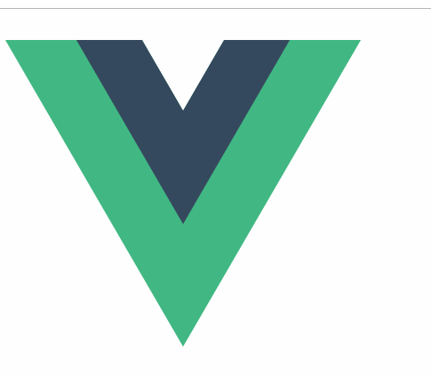

# 介绍

当鼠标hover 上元素时,给元素加一层遮罩层。

# 效果图



# 使用

```js
import VueHoverMask from 'vue-hover-mask'
export default {
  components: {
    VueHoverMask
  }
}
```

# 示例

```html
<template>
  <div id="app">
    <vue-hover-mask @click="handleClick">
      <!-- 默认插槽 -->
      
      <!-- action插槽 -->
      <template v-slot:action>
        <i class="iconfont icon-bianji-copy">编辑</i>
      </template>
    </vue-hover-mask>
  </div>
</template>

<script>
import VueHoverMask from './components/VueHoverMask'
export default {
  name: 'app',
  components:{ VueHoverMask },
  methods: {
    handleClick() {
      console.log('click')
    }
  }
}
</script>
<style>
@import url("//at.alicdn.com/t/font_1262845_52b6h42svd7.css");
.iconfont {
  font-size: 25px;
}
</style>
```

# 组件代码

完整代码请戳☞[Vue-Components-Library/VueHoverMask](https://github.com/wangjiachen199366/Vue-Components-Library/tree/master/VueHoverMask)